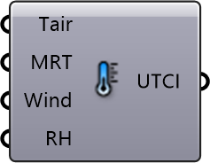

##  UTCI

UTCI Calculation
 
 Computes the Universal Thermal Climate Index (UTCI), a measure of how the weather "feels" to the human body.
 
 Combines:
 - Air Temperature (-50°C to +50°C)
 - Mean Radiant Temperature (MRT)
 - Wind Speed (0.5-17 m/s)
 - Relative Humidity
 
 
 Eddy3D 0.5.0.815

#### Input
* ##### Tair 
Ambient air temperature. Units: °C. Valid: -50 to +50°C
* ##### MRT 
Mean radiant temperature from MRT simulation or sensors. Units: °C
* ##### Wind 
Wind velocity at pedestrian height (1.5m). Units: m/s. Valid: 0.5-17 m/s
* ##### RH 
Relative humidity. Units: % (0-100)

#### Output
* ##### UTCI
Universal Thermal Climate Index. Units: °C equivalent temperature