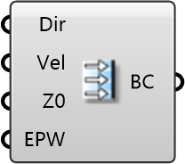

##  Uniform Flow

Uniform Wind Inlet
 
 Sets a constant wind speed across the entire inlet. Useful for wind tunnel calibration or simplified flow studies.
 
 
 Eddy3D 0.5.0.815

#### Input
* ##### Dir 
Wind directions to simulate. Units: degrees (0-359). 0° = North, 90° = East.
* ##### Vel 
Uniform wind speed (constant at all heights). Units: m/s. Default: 5 m/s
* ##### Z0 
Aerodynamic roughness for turbulence calculation. Units: m. Default: 1m
* ##### EPW 
Optional: Path to EnergyPlus weather file (.epw) for climate data.

#### Output
* ##### BC
Wind inlet boundary condition for Domain component