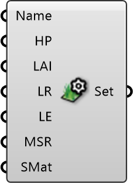

##  Vegetation Settings

Vegetation surface settings 
 Eddy3D 0.5.0.815

#### Input
* ##### Name 
Material Name
* ##### HP 
Height of Plants [m]
* ##### LAI 
LeafAreaIndex [dimensionless]
* ##### LR 
LeafReflectivity [0-1]
* ##### LE 
LeafEmissivity [0-1]
* ##### MSR 
MinimumStomatalResistance [s/m]
* ##### SMat 
Optional Radiance Surface Material

#### Output
* ##### Set
Vegetation settings