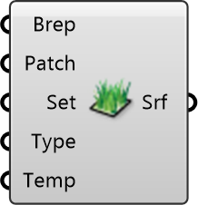

##  Vegetation Surface

Create grass/lawn surfaces for MRT simulation.
 
 Models low vegetation with evapotranspiration cooling.
 Surface temperatures are typically lower than paved surfaces.
 
 
 Eddy3D 0.5.0.815

#### Input
* ##### Brep 
Vegetation surface geometry as Brep(s).
* ##### Patch 
Mesh subdivision size. Units: m. Default: 3
* ##### Set 
Optional: Radiance material settings.
* ##### Type 
Surface temperature calculation method.
* ##### Temp 
Override surface temperature. Units: °C

#### Output
* ##### Srf
Vegetation surfaces for MRT Simulation component