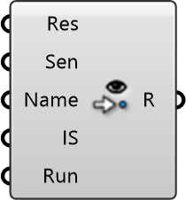

##  WProbes

Wind Field Visualizer
 
 Generates visualizations of the wind field, including vector arrows and streamlines, to understand flow patterns and identify problematic high-wind or stagnant zones.
 
 
 Eddy3D 0.5.0.815

#### Input
* ##### Res 
Eddy Result
* ##### Sen 
Wind sensors. Provide as [Mesh] or [RProbe]
* ##### Name 
Name of instance to be probed
* ##### IS 
Interpolation Scheme
* ##### Run 
Run the component.

#### Output
* ##### R
Result file path