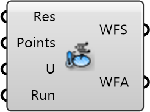

##  Wind Factors

Wind Amplification Factors
 
 Calculates the ratio between local wind speed and reference meteorological wind speed to identify areas of acceleration or shelter.
 
 Based on collected data, this component calculates wind factors for each probing point [8760 hourly branches x number of probing points].
 Factors are derived from wind velocity and direction for each hour, scaled by probing height. Supports either a look-up for the closest simulated wind direction or an interpolation between directions.
 
 
 Eddy3D 0.5.0.815

#### Input
* ##### Res 
Eddy Result
* ##### Points 
List of probing points (caution: might have been culled). It is assumed that your probes are probed at z= 2, regardless of the z-values of the probing points.
* ##### U 
Wind Velocity [DataTree] where the [branches] are the wind directions and the [items] are the values for each probing point.
* ##### Run 
Run the calculation

#### Output
* ##### WFS
Wind Amplification Factors Spatial
 
 Wind Amplification Factors (dimensionless wind velocity) for each simulated wind direction.
 This yields a datatree of the size [Number of simulated wind directions x number of sensor points].
* ##### WFA
Wind Factors Annual
 
 Wind Factors multiplied with the corresponding EPW wind velocity from the nearest simulated wind direction for every hour of the year.
 This yields a datatree of the size [8760 h x number of sensor points].