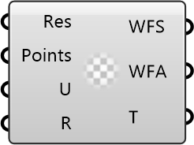

##  Wind Factors2

Wind Factors2
 
 Based on the probed simulation and the weather data, this component calculates wind velocities, wind factors for each probing point [8760 hourly branches x number of probing points].
 The wind factors are calculated based on the wind velocity and direction for each hour which is scaled up/down accordingly given probing height from ground.
 For this, we support either a look-up for the closest simulated wind direction or an interpolation between the closest two wind directions.
 
 Eddy3D 0.5.0.815

#### Input
* ##### Res 
Eddy Result
* ##### Points 
List of probing points (caution: might have been culled)
* ##### U 
Wind Velocity [DataTree] where the [branches] are the wind directions and the [items] are the values for each probing point.
* ##### R 
R

#### Output
* ##### WFS
Wind Amplification Factors Spatial
 
 Wind Amplification Factors (dimensionless wind velocity) for each simulated wind direction.
 This yields a datatree of the size [Number of simulated wind directions x number of sensor points].
* ##### WFA
Wind Factors Annual
 
 Wind Factors multiplied with the corresponding EPW wind velocity from the nearest simulated wind direction for every hour of the year.
 This yields a datatree of the size [8760 h x number of sensor points].
* ##### T
T