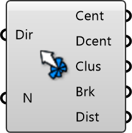

##  Wind Rose Cluster

Wind Rose Clustering
 
 Groups wind directions into representative clusters to reduce simulation time. Essential for performing annual wind comfort analysis efficiently without simulating every single direction.
 
 
 Eddy3D 0.5.0.815

#### Input
* ##### Dir 
Wind directions (0-360°) from weather data.
* ##### N 
Target number of wind directions to simulate. Default: 8

#### Output
* ##### Cent
Cluster centroid directions.
* ##### Dcent
Sorted list of unique cluster centroids.
* ##### Clus
Data tree of points in each cluster.
* ##### Brk
Jenks-Fisher natural breaks.
* ##### Dist
Total clustering distance (error).