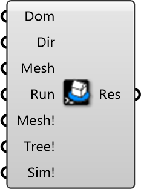

##  Wind Simulation

Steady-State Wind Solver (SimpleFoam)
 
 Executes the OpenFOAM 'simpleFoam' solver (Steady-state RANS) to calculate mean wind flow patterns.
 
 Workflow:
 1. Connect Domain and Settings
 2. Run Meshing (snappyHexMesh)
 3. Run Simulation (simpleFoam)
 
 
 Eddy3D 0.5.0.815

#### Input
* ##### Dom 
CFD domain from Box Domain or Cylindrical Domain component.
* ##### Dir 
Folder for simulation files. Default: User\Eddy. Requires ~1GB per wind direction.
* ##### Mesh 
Optional: snappyHexMesh refinement settings from Mesh Settings component.
* ##### Run 
Optional: Solver settings (iterations, turbulence model) from Run Settings component.
* ##### Mesh! 
Set True to generate CFD mesh using snappyHexMesh. Check residuals before running simulation.
* ##### Tree! 
Set True to create porous zone definitions for vegetation. Run after meshing.
* ##### Sim! 
Set True to run CFD simulation using simpleFoam. Monitor residuals for convergence.

#### Output
* ##### Res
Simulation result for post-processing. Contains velocity and pressure fields.