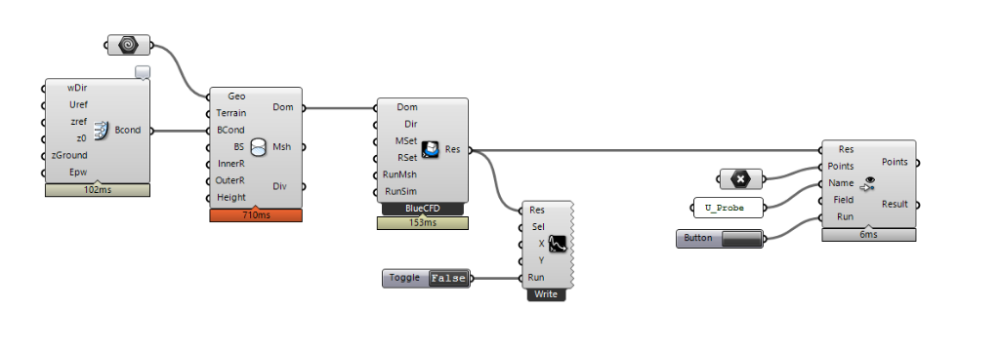

# Eddy3D &mdash; Outdoor

## Installation

### Plugin
- **Windows:** Install [Eddy3D for Windows](https://github.com/Eddy3D-Dev/Eddy3D/releases/latest)
- **Mac:** Install **`Eddy3D-OutdoorPlus`** via Rhino Package Manager (`yak`)

### Simulation Engines (Windows / Mac)
Choose a simulation engine (one of the following):
- **Docker:** [Download Docker Desktop](https://www.docker.com/products/docker-desktop/) (**Recommended cross-platform**, includes pre-configured `umcf` image)
- **BlueCFD 2020 (Windows Only):** [Download BlueCFD 2020 installer](https://github.com/blueCFD/Core/releases/download/blueCFD-Core-2020-1/blueCFD-Core-2020-1-win64-setup.exe) (Requires `urbanMicroclimateFoam` to be installed manually)
- **WSL (Windows Only):** [WSL Installation guide for Windows](https://learn.microsoft.com/en-us/windows/wsl/install) (Requires `urbanMicroclimateFoam` to be installed manually)

If you would like to use the *experimental* MRT component, please install [Radiance 5.3](https://github.com/LBNL-ETA/Radiance/releases/tag/012cb178) in the default folder: `C:\Program Files\Radiance` (Windows) or via your package manager (Mac).

### Templates

- Eddy comes with starter templates that you can find by right clicking on the `Template`  
  component, see below.

- Select a template of your choice and follow the enumerated markers through the canvas.

### Parallel computation

There is currently an issue with Microsoft’s and BlueCFD’s MPI dll which is why a run with multiple CPUs might fail. You need both dlls to be the same file, see the [CFD Online instructions for matching MPI DLL files](https://www.cfd-online.com/Forums/openfoam-installation/200437-bluecfd-core-2016-user-compiled-solvers-not-running-parallel.html#post687582) to ensure that both DLLs are the same file.

### Simple workflows

We value efficient workflows! See below for a one-directional urban CFD setup.

## Video tutorials

### Simple wind analysis

<iframe title="Video tutorial: Simple wind analysis" src="https://player.vimeo.com/video/375687568" width="640" height="360" frameborder="0"    allowfullscreen></iframe>

### Multi-directional / annual wind analysis

<iframe title="Video tutorial: Multi-directional / annual wind analysis" src="https://player.vimeo.com/video/375755947" width="640" height="360" frameborder="0"    allowfullscreen></iframe>

### Pressure coefficients on building façade

<iframe title="Video tutorial: Pressure coefficients on building façade" src="https://player.vimeo.com/video/375755963" width="640" height="360" frameborder="0"    allowfullscreen></iframe>

### Eddy3D & Paraview Workshop

<iframe title="Video tutorial: Eddy3D & Paraview Workshop" src="https://player.vimeo.com/video/1136117320" width="640" height="360" frameborder="0"    allowfullscreen></iframe>

