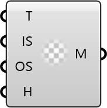

##  Advanced Terrain Mesh

Generate a multi-resolution terrain mesh with a solid base.

#### Input
* ##### Geo 
Input geometry used to generate the terrain mesh.
* ##### Inner 
Scale factor for the high-detail inner region. Optional; default is 0.5.
* ##### Outer 
Scale factor for the low-detail outer region. Optional; default is 1.2.
* ##### Base 
Height of the solid base below the terrain. Optional; default is 10.

#### Output
* ##### Mesh
Generated terrain mesh.