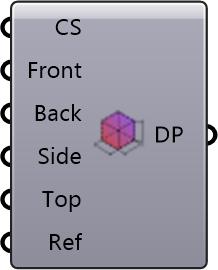

##  Box Domain

Define simulation domain extents and refinement padding.
 OutdoorPlus 0.0.20.0

#### Input
* ##### CS 
Base cell size for the domain (model units).
* ##### Front 
Padding in front of the geometry bounding box (model units).
* ##### Back 
Padding behind the geometry bounding box (model units).
* ##### Side 
Padding on the side faces of the geometry bounding box (model units).
* ##### Top 
Padding above the geometry bounding box (model units).
* ##### Ref 
Padding applied to the refinement box around the geometry (model units).

#### Output
* ##### DP
Domain and refinement box parameters as a list.