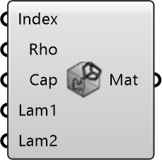

##  Building Material

Select a building material by index and override its properties.
 OutdoorPlus 0.0.20.0

#### Input
* ##### Index 
Index into the material list (0=AsphaltConcrete, 1=CalciumSilicate, 2=Hamstad5Brick, 3=Hamstad5Insulation, 4=Hamstad5Mortar, 5=HamstadBrick, 6=HamstadCase2, 7=HamstadConcrete, 8=HamstadPlaster, 9=Impermeable, 10=PorousAsphalt, 11=SabaBrick, 12=SabaBrickMod, 13=Soil, 14=VanGenuchten, 15=VanGenuchtenVapDiff).
* ##### Rho 
Material density (rho). Optional; default is 1600.
* ##### Cap 
Heat capacity (cap). Optional; default is 1000.
* ##### Lam1 
Primary thermal conductivity (lambda1). Optional; default is 0.682.
* ##### Lam2 
Secondary thermal conductivity (lambda2). Optional; default is 0.0.

#### Output
* ##### Mat
Building material settings.