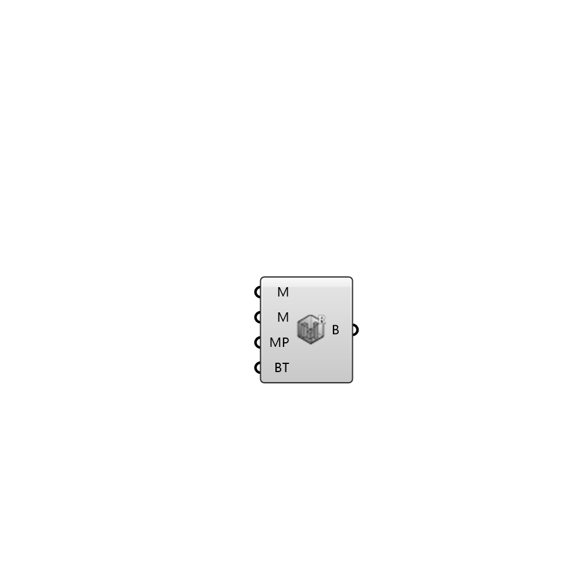

##  Building Region

Building Region 
 OutdoorPlus 0.0.20.0

#### Input
* ##### M 
Mesh of this building
* ##### M 
Material of this building
* ##### T 
Thickness of this solid
* ##### MP 
Building mesh parameters
* ##### BT 
Temperature inside the building in Celcius. This value stays constant for the entire simulation time

#### Output
* ##### B
Building region.