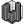

##  Building Region

Create a building (solid) region for the UMCF case.
 OutdoorPlus 0.0.20.0

#### Input
* ##### Mesh 
Closed building meshes for the region.
* ##### Mat 
Building material settings.
* ##### Thk 
Wall thickness (model units). Optional; default is 0.1.
* ##### MeshSet 
Meshing settings for the building region.
* ##### TIn 
Indoor air temperature (deg C). Optional; default is 22 and remains constant over time.

#### Output
* ##### Building
Building region object for the case.