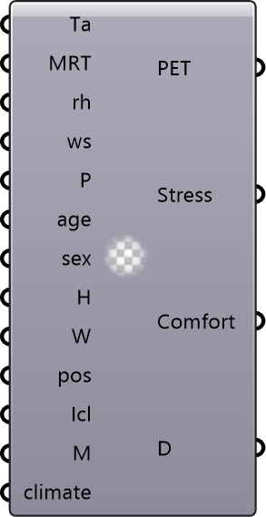

##  CalcPET

Calculate PET (Physiological Equivalent Temperature) from environmental and personal inputs.

#### Input
* ##### Ta 
Air temperature (deg C). Optional; default is 20.
* ##### MRT 
Mean radiant temperature (deg C). Optional; default is 20.
* ##### RH 
Relative humidity (%). Optional; default is 50.
* ##### WS 
Wind speed (m/s). Optional; default is 0.1.
* ##### P 
Atmospheric pressure (hPa). Optional; default is 1013.25.
* ##### Age 
Age in years. Optional; default is 35.
* ##### Sex 
Sex ('Male', 'Female', or 'Average'). Optional; default is Average.
* ##### Ht 
Height (m). Optional; default is 1.75.
* ##### Wt 
Weight (kg). Optional; default is 75.
* ##### Pos 
Body position ('Standing', 'Sitting', or 'Crouching'). Optional; default is Standing.
* ##### Icl 
Clothing insulation (clo). Optional; default is 0.9.
* ##### Met 
Metabolic rate (W). Optional; default is 80.
* ##### Climate 
Climate type ('Temperate' or 'Humid'). Optional; default is Temperate.

#### Output
* ##### PET
Physiological Equivalent Temperature (deg C).
* ##### Stress
Thermal stress category based on PET.
* ##### Comfort
Thermal comfort category.
* ##### Details
Detailed calculation results.