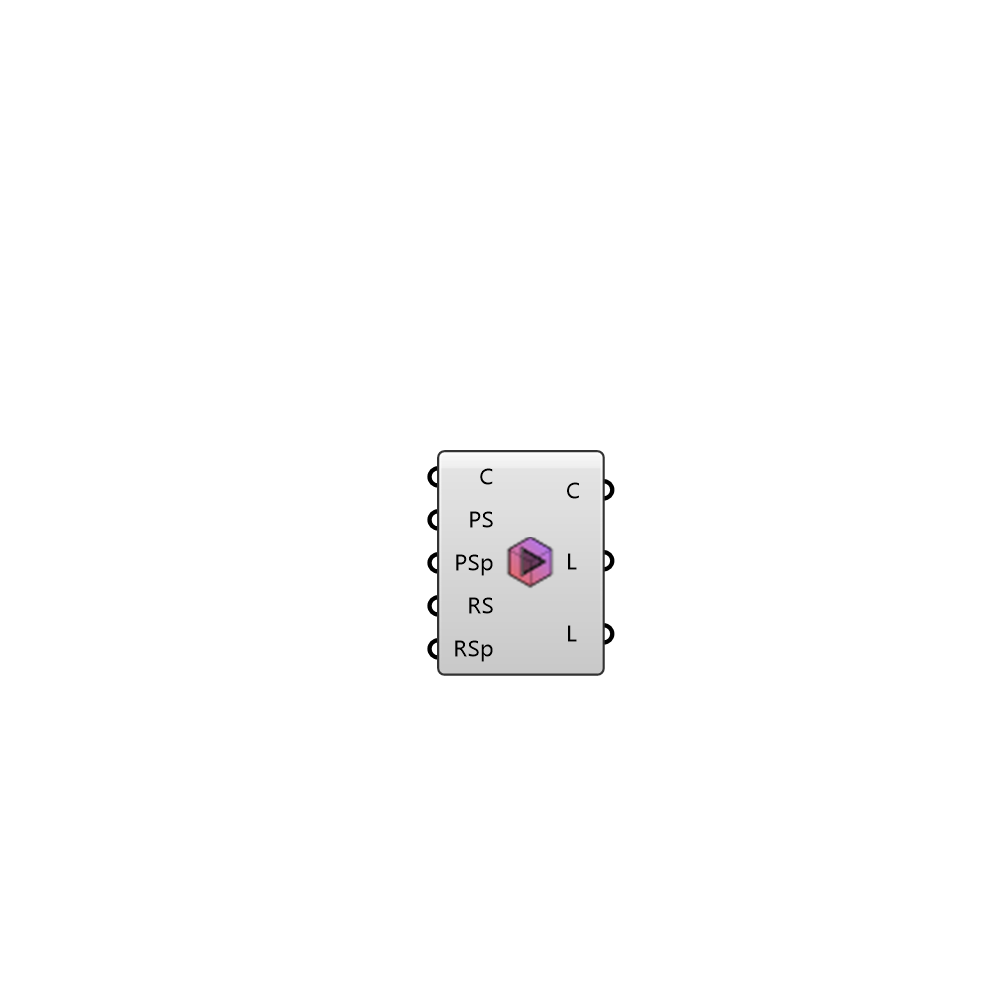

##  Case Run

Runs the case 
 OutdoorPlus 0.0.20.0

#### Input
* ##### C 
Case to run the simulation on
* ##### PS 
Set to true to prepare the simulation
* ##### RS 
Set to true to run the simulation
* ##### P 
Set to true to compute in parallel

#### Output
* ##### C
Case that contains the simulation
* ##### L
Logs