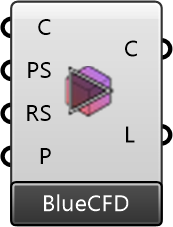

##  Case Run

Prepare and run a UMCF case.
 Eddy3D 1.0.0.827

#### Input
* ##### Case 
Case to prepare and/or run.
* ##### Prep 
Prepare meshing and case setup.
* ##### Run 
Run the simulation solver.
* ##### Parallel 
Run the case in parallel if enabled.

#### Output
* ##### Case
Updated case after prepare/run.
* ##### Logs
Latest execution logs.