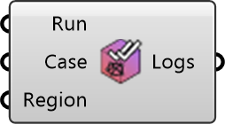

##  CheckMesh

Run the OpenFOAM checkMesh command for a case region.
 OutdoorPlus 0.0.20.0

#### Input
* ##### Run 
Run the checkMesh command.
* ##### Case 
UMCF case instance to check.
* ##### Region 
Region name to check.

#### Output
* ##### Logs
Log output from the checkMesh command.