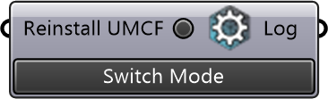

##  Check & Install Engine

Check and install the CFD engine (BlueCFD or WSL) and urbanMicroclimateFoam.

#### Input
* ##### Reinstall UMCF 
Rebuild the urbanMicroclimateFoam solver for BlueCFD.

#### Output
* ##### Log
Installation output and status.