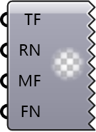

##  Create Address

Create a MetaFOAM Address for entries and settings.

#### Input
* ##### Top 
Top folder index: 0=root, 1=system, 2=constant, 3=zero.
* ##### Region 
Region name.
* ##### Folders 
Optional subfolders between region and file.
* ##### File 
Target file name.

#### Output