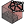
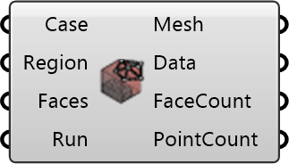

##  Create Mesh

Create a visualization mesh from polyMesh point/face data.
 OutdoorPlus 0.0.20.0

#### Input
* ##### Case 
UMCF case used to locate the mesh data.
* ##### Region 
Region name to visualize.
* ##### Faces 
Optional face indices to visualize.
* ##### Run 
Generate the mesh when true.

#### Output
* ##### Mesh
Generated unified mesh.
* ##### Data
Geometric and topological mesh data.
* ##### FaceCount
Total face count in the polyMesh.
* ##### PointCount
Total point count in the polyMesh.