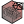

##  Create Mesh

Creates a mesh from point and face data in .txt files 
 OutdoorPlus 0.0.20.0

#### Input
* ##### C 
OutdoorPlus Case class to extract the working directory
* ##### R 
OutdoorPlus Case region to visualize
* ##### I 
List of face indices to visualize (optional)
* ##### R 
Set to True to run the mesh generation

#### Output
* ##### M
Generated unified mesh
* ##### D
Geometric and topological mesh data
* ##### NF
Number of total faces in polyMesh
* ##### NP
Number of total points in polyMesh