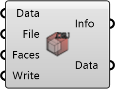

##  Create OBJ

Export an OBJ mesh from a polyMesh description.
 OutdoorPlus 0.0.20.0

#### Input
* ##### Data 
Geometric and topological mesh data (UMCFMesh).
* ##### File 
Output OBJ file name or path.
* ##### Faces 
Optional face indices to include in the OBJ.
* ##### Write 
Write the OBJ file when true.

#### Output
* ##### Info
OBJ export result message.
* ##### Data
Geometric and topological mesh data.