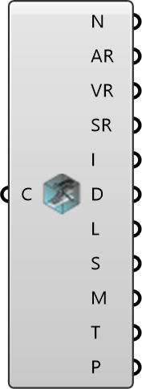

##  Deconstruct Case

Deconstruct a case instance and expose its regions and file containers.

#### Input
* ##### Case 
Case to deconstruct.

#### Output
* ##### Name
Case name.
* ##### Air
Air region in the case.
* ##### Vegetation
Vegetation regions in the case.
* ##### Solid
Solid regions in the case.
* ##### InitDicts
Initial condition dictionaries stored as file containers.
* ##### Dicts
OpenFOAM dictionaries stored as file containers.
* ##### Lists
OpenFOAM lists stored as file containers.
* ##### Scripts
Scripts stored as file containers.
* ##### Meshes
Meshes stored as mesh containers.
* ##### Text
Files that do not meet other categories.
* ##### Patches
Patch names found in the initial conditions.