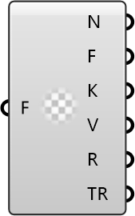

##  Deconstruct FileContainer

Deconstructs a FileContainer instance.

#### Input
* ##### File 
FileContainer instance to deconstruct.

#### Output
* ##### Address
File container address.
* ##### Type
File container file type.
* ##### Keys
File container keys.
* ##### Values
File container values.
* ##### Raw
Raw content of the file.
* ##### RawAll
Full raw content of the file.