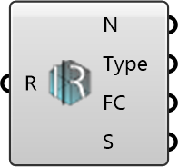

##  Deconstruct Region

Deconstruct a MetaFOAM Region instance.

#### Input
* ##### Region 
Region to deconstruct.

#### Output
* ##### Name
Region name.
* ##### Type
Region type.
* ##### Files
File containers in the region.
* ##### Setting
Region setting (if available).