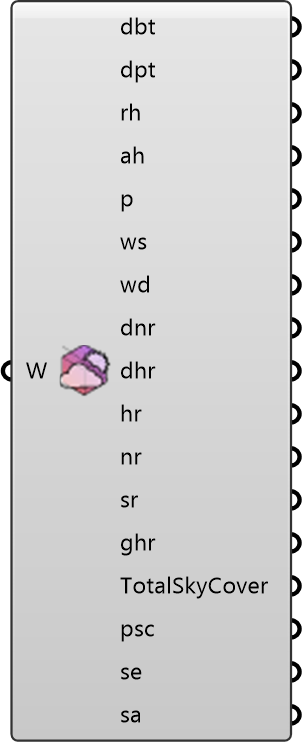

##  Deconstruct Weather

Deconstruct a Weather object into hourly time series values.
 OutdoorPlus 0.0.20.0

#### Input
* ##### Weather 
Weather object to deconstruct.

#### Output
* ##### DBT
Hourly dry-bulb temperature (deg C).
* ##### DPT
Hourly dew point temperature (deg C).
* ##### RH
Hourly relative humidity (%).
* ##### AbsH
Hourly absolute humidity.
* ##### P
Hourly atmospheric pressure.
* ##### WS
Hourly wind speed (m/s).
* ##### WD
Hourly wind direction (deg).
* ##### DNR
Hourly direct normal radiation.
* ##### DHR
Hourly diffuse horizontal radiation.
* ##### HR
Hourly horizontal radiation.
* ##### NR
Hourly normal radiation.
* ##### SR
Hourly sky radiation.
* ##### GHR
Hourly global horizontal radiation.
* ##### TSC
Hourly total sky cover.
* ##### OSC
Hourly opaque sky cover.
* ##### SE
Hourly solar elevation (deg).
* ##### SA
Hourly solar azimuth (deg).