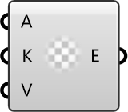

##  Entry from a Key and Value

Create an Entry from address, key, and value (not yet implemented).

#### Input
* ##### Address 
Address where the entry will modify or add content.
* ##### Key 
Entry key.
* ##### Value 
Entry value.

#### Output
* ##### Entry
Created entry (placeholder).