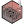
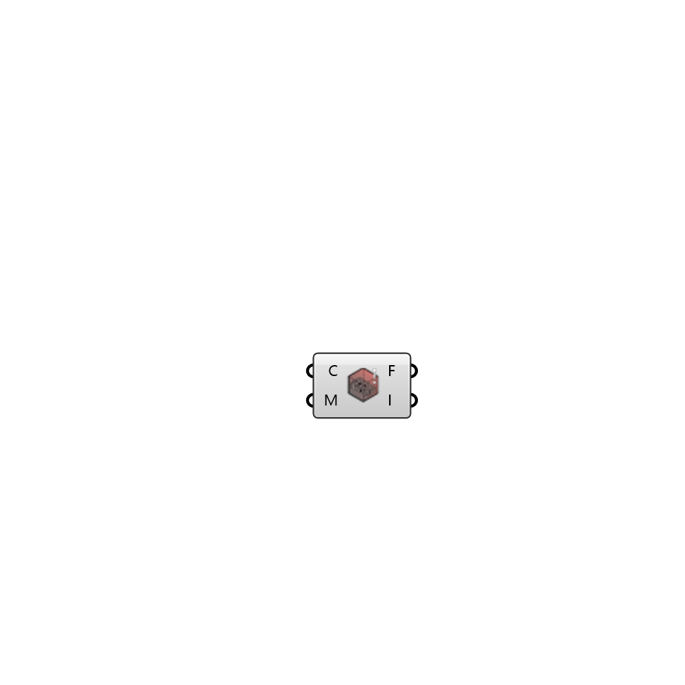

##  Face Warnings

Render mesh faces during topoSet execution that do not produce a valid tet decomposition 
 OutdoorPlus 0.0.20.0

#### Input
* ##### C 
OutdoorPlus Case
* ##### M 
Simulation domain mesh

#### Output
* ##### F
Mesh faces from warning logs
* ##### I
Face indices with no base point found for a valid tet decomposition