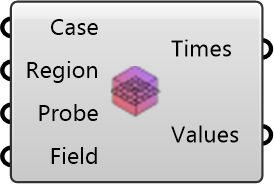

##  Get Probes

Read probe results from a case and field.
 OutdoorPlus 0.0.20.0

#### Input
* ##### Case 
Case containing probe results.
* ##### Region 
Region name to probe (default: air).
* ##### Probe 
Probe set name to read.
* ##### Field 
Field to retrieve from probes.

#### Output
* ##### Times
Simulation time steps.
* ##### Values
Probe values organized per probe point.