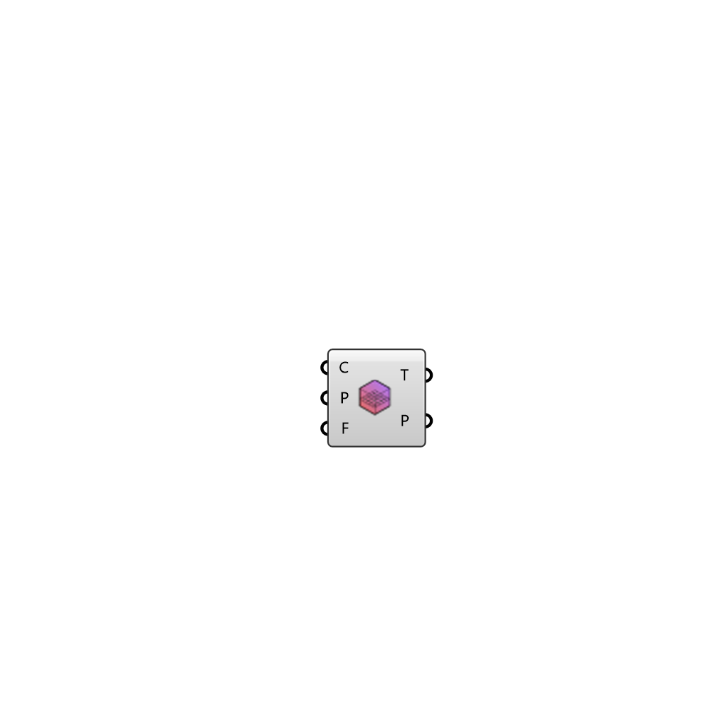

##  Get Probes

Get probe values from a field 
 OutdoorPlus 0.0.20.0

#### Input
* ##### C 
Case
* ##### R 
Region to probe
* ##### P 
Name of the probing to get information from
* ##### F 
Field to retrieve from probes

#### Output
* ##### T
Simulation time steps
* ##### P
Probe values