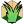
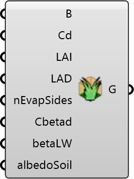

##  Grass

Define grass patches and parameters for the terrain.
 OutdoorPlus 0.0.20.0

#### Input
* ##### Boundary 
Closed curves for grass areas (projected onto the terrain mesh).
* ##### Cd 
Grass drag coefficient (Cd). Optional; default is 0.2.
* ##### LAI 
Leaf area index (LAI). Optional; default is 2.
* ##### LAD 
Leaf area density (LAD). Optional; default is 20.
* ##### EvapSides 
Evaporation sides parameter (nEvapSides). Optional; default is 1.
* ##### Beta 
Beta parameter. Optional; default is 0.5.
* ##### BetaLW 
Longwave beta parameter (betaLW). Optional; default is 1000.
* ##### Albedo 
Soil albedo (albedoSoil). Optional; default is 0.4.

#### Output
* ##### Grass
Grass settings for the case.