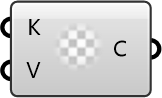

##  OpenFOAM Dictionary

Create an OpenFOAM dictionary for file modification inputs.

#### Input
* ##### Keys 
Keys to store in the OpenFOAM dictionary.
* ##### Values 
Values to store in the OpenFOAM dictionary.

#### Output
* ##### Dict
Created dictionary object.