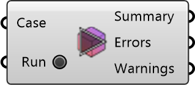

##  Parse Case Logs

Parses log files in a case folder and reports any FOAM errors.
 OutdoorPlus 0.0.20.0

#### Input
* ##### Case 
Case to parse logs from.
* ##### Run 
Parse log files when true. Optional; default is false.

#### Output
* ##### Summary
Summary of log parsing results.
* ##### Errors
Errors found in log files.
* ##### Warnings
Warnings found in log files.