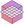
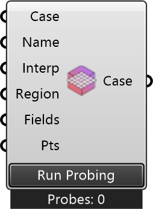

##  Probing

Define probe points and run probing for a UMCF case.
 OutdoorPlus 0.0.20.0

#### Input
* ##### Case 
Case to probe.
* ##### Name 
Name for this probe set.
* ##### Interp 
Interpolation scheme index: 0=cell, 1=cellPoint, 2=cellPointFace, 3=pointMVC, 4=cellPatchConstrained.
* ##### Region 
Region to probe (default: air).
* ##### Fields 
Field names to probe (e.g., T, U, p, k, epsilon, nut, p_rgh, rho, w).
* ##### Pts 
Points to probe in the simulation domain.

#### Output
* ##### Case
Case with probe definitions. Use GetProbes to read results.