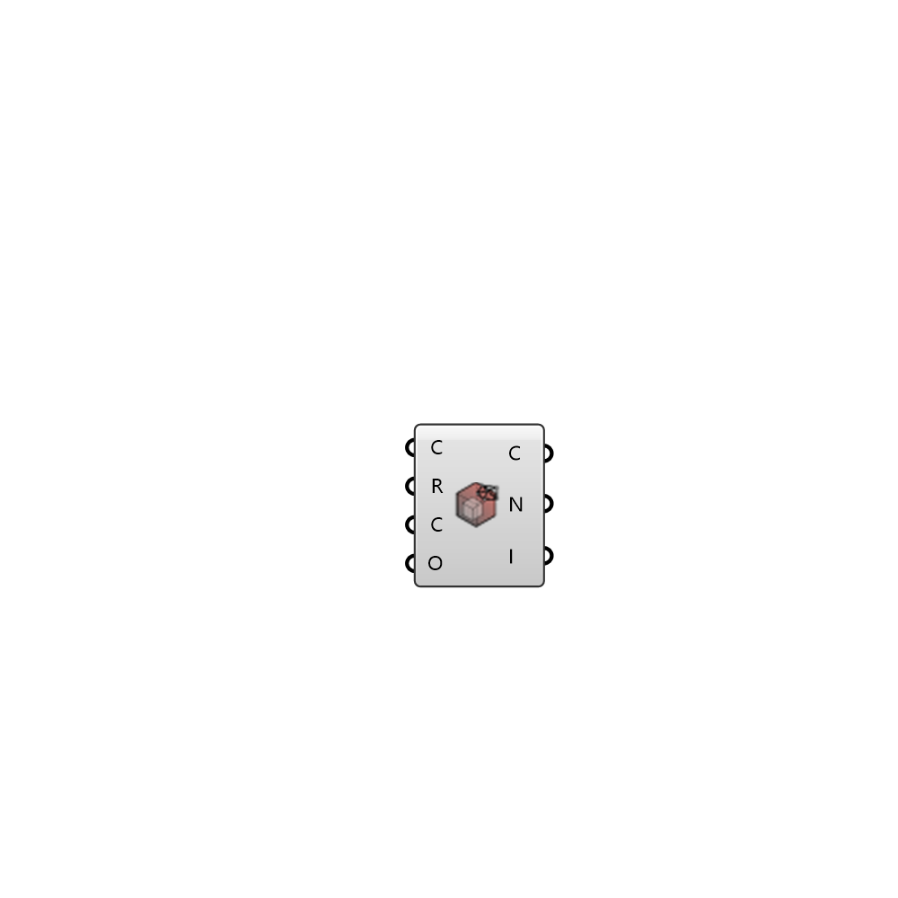

##  Read Cells

Cells from owner and neighbour files. CellZones from cellZones file if existing 
 OutdoorPlus 0.0.20.0

#### Input
* ##### C 
OutdoorPlus Case class to extract the working directory
* ##### R 
OutdoorPlus Case region to visualize
* ##### C 
Chunk size for reading the owner and neighbour files
* ##### O 
Chunk offset for reading the owner and neighbour files

#### Output
* ##### C
List of cells containing a list of indices pointing to mesh faces
* ##### N
List of cell zone names
* ##### I
List of indices for each cell zone