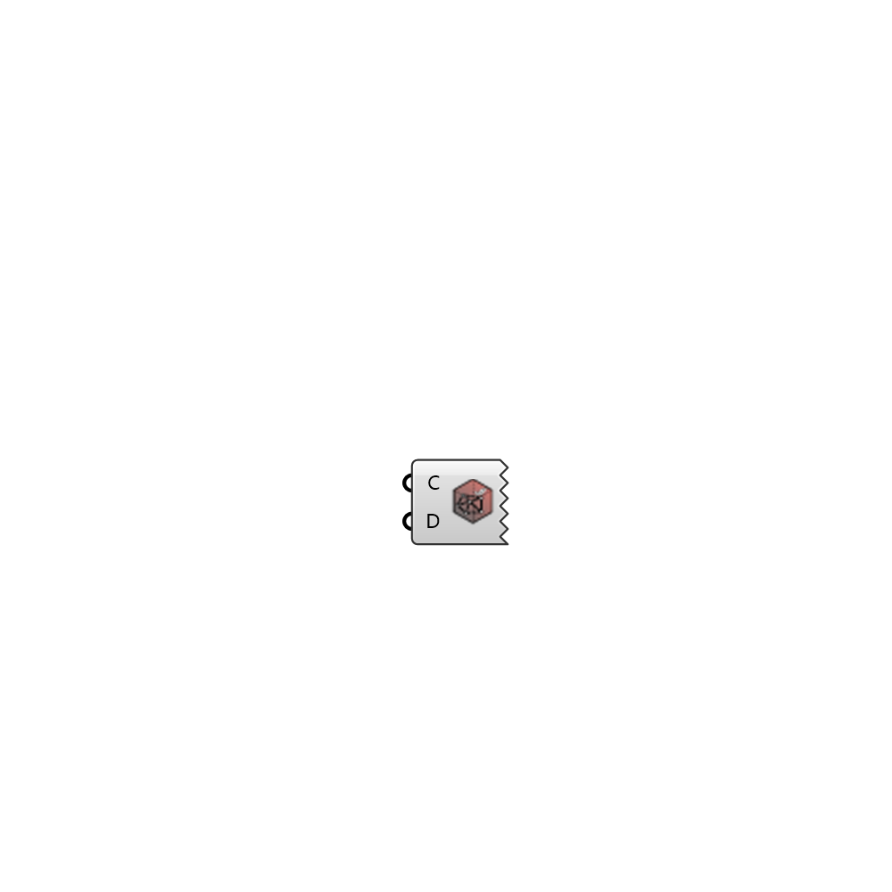

##  Read checkMesh

Read and visualize sets resulting from checkMesh function 
 OutdoorPlus 0.0.20.0

#### Input
* ##### C 
OutdoorPlus Case class to extract the working directory
* ##### D 
OutdoorPlus Mesh class to filter mesh faces and cells

#### Output