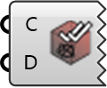

##  Read checkMesh

Read and visualize sets produced by checkMesh.
 OutdoorPlus 0.0.20.0

#### Input
* ##### Case 
UMCF case containing checkMesh set files.
* ##### Mesh 
UMCF mesh data used to extract faces and points.

#### Output