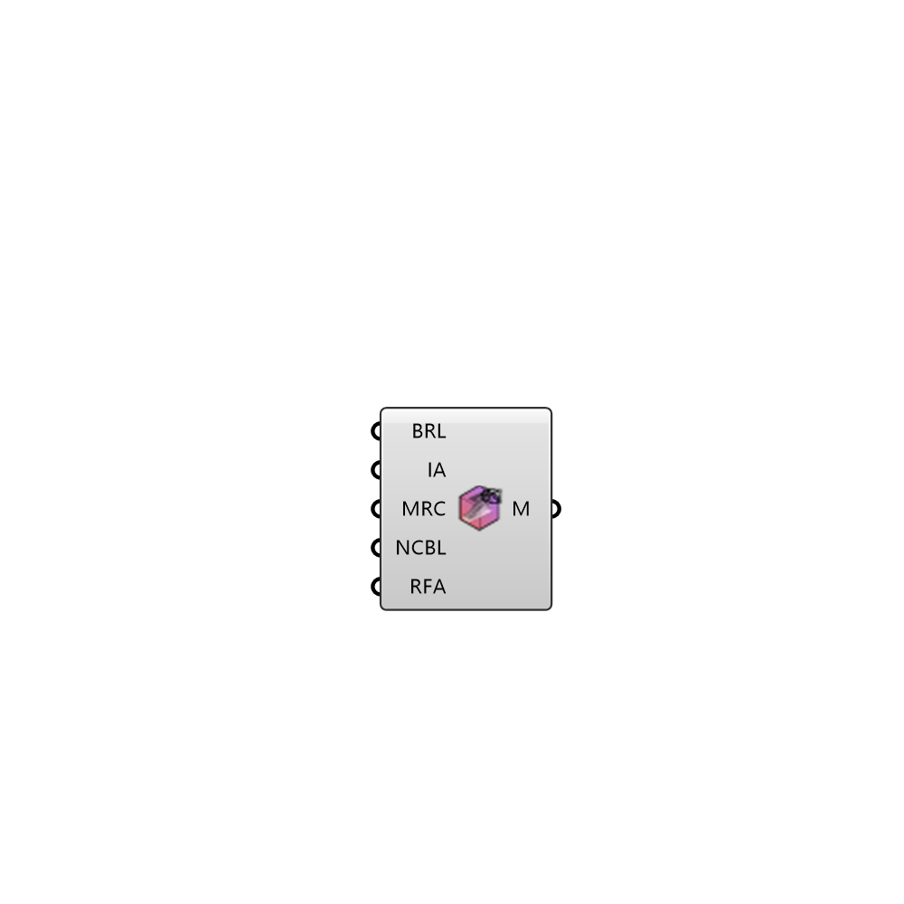

##  Simulation MeshSettings

Simulation mesh settings 
 OutdoorPlus 0.0.20.0

#### Input
* ##### L 
Set to true to add layers. True by default
* ##### BRL 
Refinement level inside refinement box
* ##### MRC 
Minimum refinement of cells
* ##### MLU 
Max Load Unbalance
* ##### NCBL 
Number of cells between levels
* ##### RFA 
Resolve feature angle
* ##### ST 
Snap tolerance
* ##### SNIter 
Number of solver iterations for snapping
* ##### SNRelaxIter 
Number of relaxation iterations for snapping
* ##### SNFeatureSnapIter 
Number of feature snap iterations for snapping
* ##### IA 
Identify a feature when angle between faces < includedAngle

#### Output
* ##### M
Simulation mesh settings.