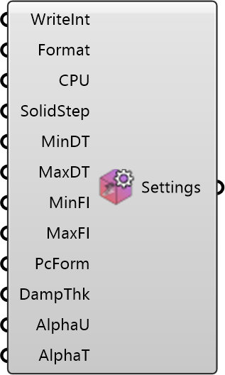

##  Simulation Settings

Configure simulation control settings for UMCF.
 OutdoorPlus 0.0.20.0

#### Input
* ##### WriteInt 
Write interval in time steps. Optional; uses solver default if omitted.
* ##### Format 
Write format: 0=ascii, 1=binary, 2=compressed.
* ##### CPU 
Number of CPUs/subdomains to use. Optional; default is 1.
* ##### SolidStep 
Initial solid time step factor for UMCF controlDict. Optional.
* ##### MinDT 
Minimum time step between iterations. Optional.
* ##### MaxDT 
Maximum time step between iterations. Optional.
* ##### MinFI 
Minimum fluid iterations per time step. Optional.
* ##### MaxFI 
Maximum fluid iterations per time step. Optional.
* ##### PcForm 
'pc-based' or 'mixed' (default is pc-based).
* ##### DampThk 
Blending coefficients: damping thickness. Optional.
* ##### AlphaU 
Blending coefficients: alphaCoeffU. Optional.
* ##### AlphaT 
Blending coefficients: alphaCoeffT. Optional.

#### Output
* ##### Settings
Simulation control settings.