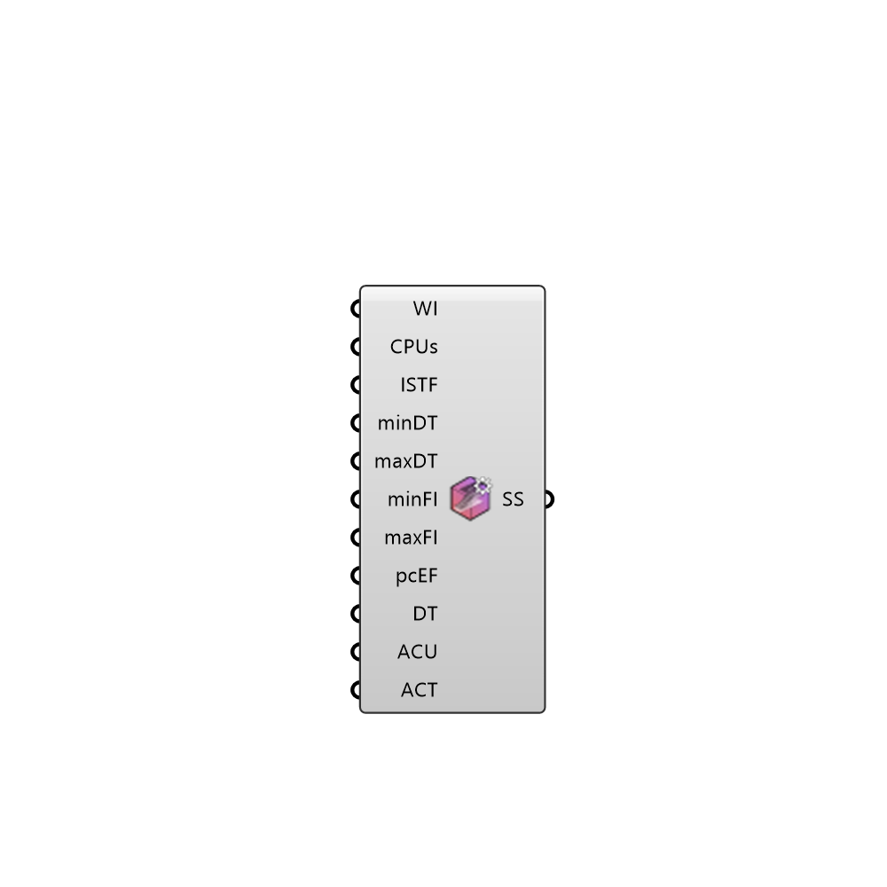

##  Simulation Settings

Simulation settings 
 OutdoorPlus 0.0.20.0

#### Input
* ##### WI 
Write interval
* ##### WF 
0 = ASCII; 1 = binary; 2 = compressed
* ##### CPUs 
Number of CPUs to be used
* ##### ISTF 
urbanMicroclimateFoam controls: Initial Solid Timestep Factor
* ##### minDT 
urbanMicroclimateFoam controls: Minimum time between iterations
* ##### maxDT 
urbanMicroclimateFoam controls: Maximum time between iterations
* ##### minFI 
urbanMicroclimateFoam controls: maxFluidIteration
* ##### maxFI 
urbanMicroclimateFoam controls: maxFluidIteration
* ##### pcEF 
'pc-based' or 'mixed' - default is 'pc-based'
* ##### DT 
blendingCoeffs: Damping thickness
* ##### ACU 
blendingCoeffs: alphaCoeffU
* ##### ACT 
blendingCoeffs: alphaCoeffT

#### Output
* ##### SS
Simulation settings