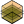

##  Soil Material

Define soil material properties for terrain layers.
 OutdoorPlus 0.0.20.0

#### Input
* ##### Rho 
Material density (rho). Optional; default is 1150.
* ##### Cap 
Heat capacity (cap). Optional; default is 650.
* ##### Lam1 
Primary thermal conductivity (lambda1). Optional; default is 1.5.
* ##### Lam2 
Secondary thermal conductivity (lambda2). Optional; default is 0.0.

#### Output
* ##### Mat
Soil material settings for terrain layers.