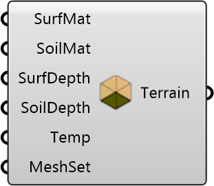

##  Terrain Region

Create a terrain region with materials and depth settings.
 OutdoorPlus 0.0.20.0

#### Input
* ##### SurfMat 
Material settings for the surface layer.
* ##### SoilMat 
Material settings for the soil layer.
* ##### SurfDepth 
Surface layer depth. Optional; default is 0.1.
* ##### SoilDepth 
Soil layer depth. Optional; default is 1.9.
* ##### Temp 
Initial terrain temperature (deg C). Optional; default is 25.
* ##### MeshSet 
Optional meshing settings for the terrain region.

#### Output
* ##### Terrain
Terrain region object for the case.