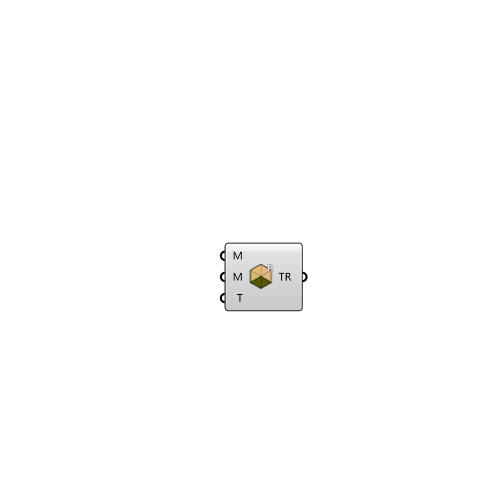

##  Terrain Region

Creates a terrain region 
 OutdoorPlus 0.0.20.0

#### Input
* ##### M 
Mesh representing the terrain
* ##### M 
Terrain material
* ##### D 
Depth of the underground
* ##### T 
Temperature of the terrain
* ##### TMP 
Terrain mesh parameters
* ##### GB 
Grass boundaries as polylines
* ##### G 
Grass

#### Output
* ##### TR
The created terrain region