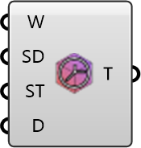

##  Timing Parameters

Define simulation timing and optional weather-driven time series.
 OutdoorPlus 0.0.20.0

#### Input
* ##### Weather 
Optional weather data for time series inputs.
* ##### StartDay 
Day-of-year index to start (0-based). Optional; default is 0.
* ##### StartHour 
Hour of day to start (0-23). Optional; default is 0.
* ##### Hours 
Simulation duration in hours. Optional; default is 24.

#### Output
* ##### Timing
Simulation timing settings.