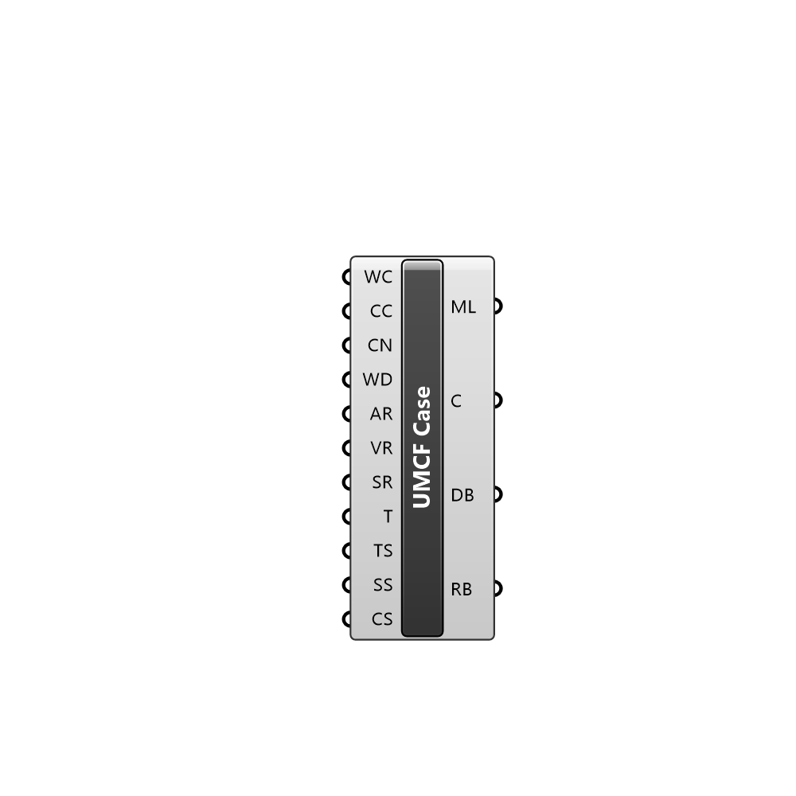

##  UrbanMicroClimateFoam Case

Creates an OutdoorPlus case 
 OutdoorPlus 0.0.20.0

#### Input
* ##### R 
Set to true to read an existing case in the working directory
* ##### W 
Set to true to write the case in the working directory
* ##### C 
Set to true to remove all files in the working directory
* ##### CN 
Name of the new case to create. It cannot contain spaces
* ##### WD 
Working directory to place the case files and results
* ##### AR 
Air region for this case
* ##### VR 
Vegetation region of this case
* ##### SR 
Solid regions of this case
* ##### TR 
Terrain region of this simulation
* ##### DBP 
Domain box parameters
* ##### TS 
Case timing settings
* ##### SS 
Simulation settings
* ##### MS 
Simulation mesh settings
* ##### VF 
View factor approach settings
* ##### CS 
Optional input for optinal entries

#### Output
* ##### ML
Case modification logs
* ##### C
Modified case
* ##### DB
Case domain
* ##### RB
Refinement box of the case
* ##### TM
Total mesh of the case
* ##### B
Building mesh
* ##### T
Terrain mesh
* ##### U
Underground mesh