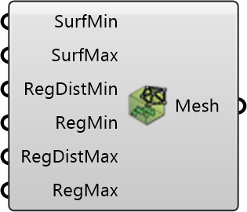

##  Vegetation Mesh Settings

Configure mesh refinement for vegetation regions.
 OutdoorPlus 0.0.20.0

#### Input
* ##### SurfMin 
Minimum surface refinement level. Optional; default is 3.
* ##### SurfMax 
Maximum surface refinement level. Optional; default is 5.
* ##### RegDistMin 
Outer distance for the lower region refinement level. Optional; default is 2.0.
* ##### RegMin 
Lower region refinement level. Optional; default is 4.
* ##### RegDistMax 
Inner distance for the higher region refinement level. Optional; default is 1.0.
* ##### RegMax 
Upper region refinement level. Optional; default is 5.

#### Output
* ##### Mesh
Mesh refinement settings for vegetation regions.