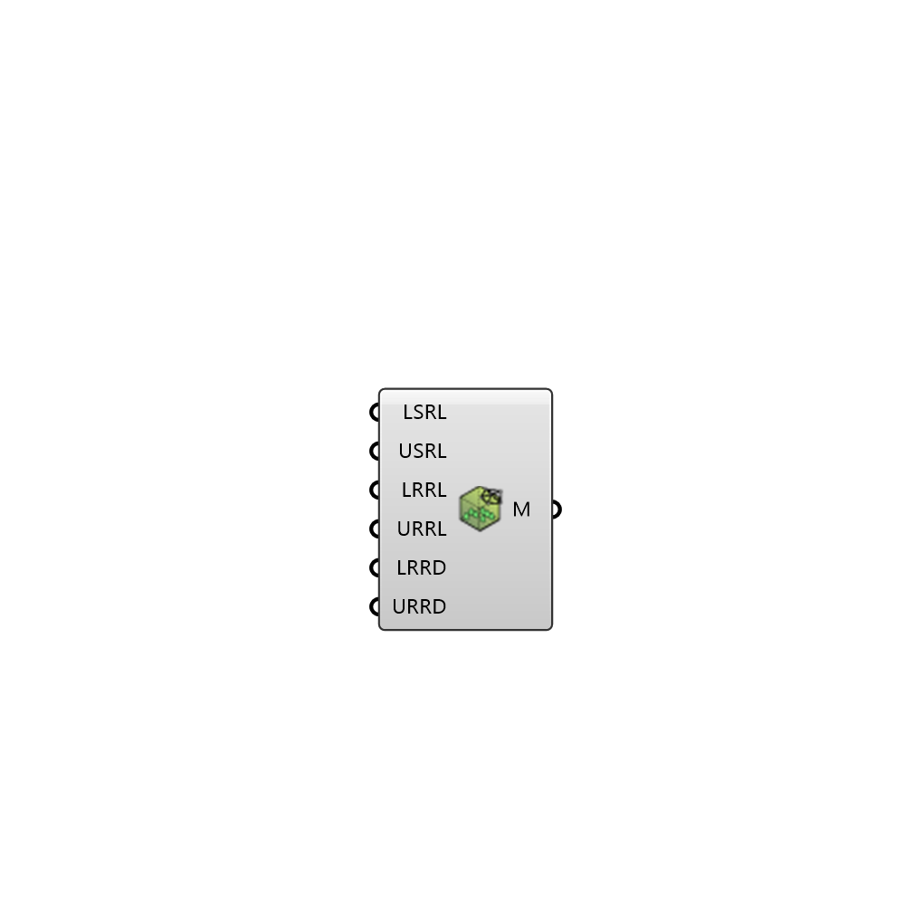

##  Vegetation Mesh Settings

Vegetation mesh settings 
 OutdoorPlus 0.0.20.0

#### Input
* ##### MnSR 
Minimum refinement on surfaces. Default value is '3'
* ##### MxSR 
Maximum refinement on surfaces. Default value is '5'
* ##### DRMnRF 
Lower distance to which apply region refinement level. Default value is '1.0'
* ##### MnRF 
Lower value of region refinement level. Default value is '5'
* ##### DRMxRF 
Upper distance to which apply region refinement level. Default value is '2.0'
* ##### MxRF 
Upper value of region refinement level. Default value is '4'

#### Output
* ##### M
Vegetation mesh settings