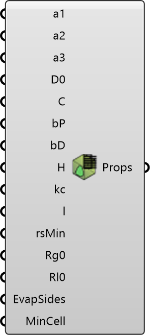

##  Vegetation Properties

Define vegetation property coefficients for canopy modeling.
 OutdoorPlus 0.0.20.0

#### Input
* ##### a1 
Stomatal resistance coefficient a1. Optional; default is 169.
* ##### a2 
Stomatal resistance coefficient a2. Optional; default is 18.
* ##### a3 
Stomatal resistance coefficient a3. Optional; default is 0.005.
* ##### D0 
Stomatal resistance coefficient D0. Optional; default is 1.2.
* ##### C 
Proportionality factor. Optional; default is 131.035.
* ##### bP 
Turbulent production coefficient. Optional; default is 1.0.
* ##### bD 
Turbulent destruction coefficient. Optional; default is 5.1.
* ##### H 
Canopy height (H). Optional; default is 1.5.
* ##### kc 
Radiation extinction coefficient (kc). Optional; default is 0.5.
* ##### l 
Characteristic leaf length (l). Optional; default is 0.1.
* ##### rsMin 
Minimum stomatal resistance (rsMin). Optional; default is 150.
* ##### Rg0 
Global radiation at canopy top (Rg0). Optional; default is 800.
* ##### Rl0 
Long-wave radiation at canopy top (Rl0). Optional; default is 350.
* ##### EvapSides 
Number of evaporation sides. Optional; default is 1.
* ##### MinCell 
Minimum cell size factor. Optional; default is 10.

#### Output
* ##### Props
Vegetation properties as a Setting instance.